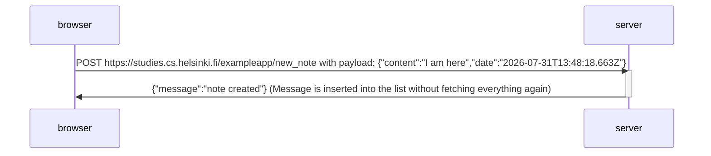

FlowChart of the interactions between the browser and the server when the user opens the single page notes app:

```mermaid
sequenceDiagram
    participant browser
    participant server

    browser->>server: POST https://studies.cs.helsinki.fi/exampleapp/new_note with payload: {"content":"I am here","date":"2026-07-31T13:48:18.663Z"}
    activate server 
    server->>browser: {"message":"note created"} (Message is inserted into the list without fetching everything again)
    deactivate server

```

